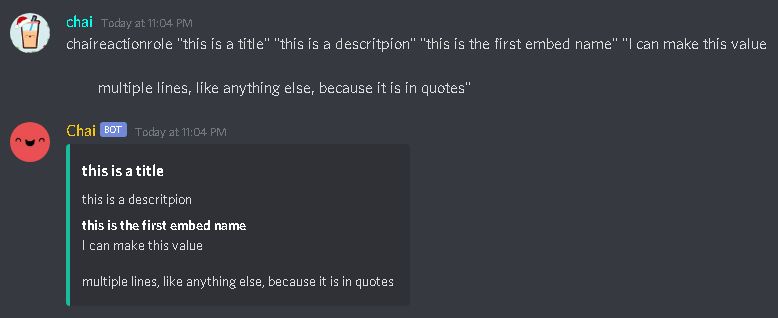
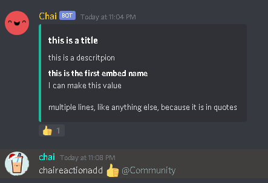

# Welcome to Chaibot Documentation

Chaibot's commands with how-two's and examples. [https://top.gg/bot/728115804826239017](https://top.gg/bot/728115804826239017).

## Commands
    Below are all commands for Chaibot, sorted in custom categories for each set of commands. Using the navigation on the left is a big help, I recommend making use of it.

### Main Commands
    The main commands for chaibot: can be used by anyone in the server

    - If the command description does not have a "Use example", it does not accept any parameters.
    
    - If no "Use level" is specified, it can be used by anoyone with permission to send messages.
#### Aes
    Raw command: chaiaes

    Description - Will return the current AES mainKey and Version of Fortnite
    
        
#### Aesdump
    chaiaesdump
        
        Description - Will return any of the current AES data encrypted at the time.

        
#### Creatorsearch
    chaicreatorsearch "creator_code"

        Description - Will return any information based on the creator code set.
        
        Use Example - chaicreatorsearch Ninja
        
        
#### Findstring
    chaifindstring "string to find"

        Description - Will find any game file paths with the keyword string set as a paramater.
        
        Use Example - chaifindstring Athena

        
#### Guilds
    chaiguilds

        Description - Will return the total amount of guilds that ChaiBot is in.

        
#### Invitechai
    chaiinvitechai

        Description - Will return a raw invite link to add ChaiBot to another server.

        
#### Itemshop
    chaiitemshop

        Description - Will return the current Battle Royale itemshop

        

#### Leaderboard
    chaileaderbaord

        Description - Will return the top 25 NAE hype players

        
#### Map
    chaimap

        Description - Will return the current Fortnite Map. 
            This may take some time to update between new updates.

        
#### Newcosmetics
    chainewcosmetics

        Description - Will return the most up to date leaked cosmetics
                      Due to the new encrypted pak files that Epic has put into place,
                      we might not see any updates for some time, or until the API has been fixed.
#### News
    chainews

        Description - Will return the most up to date BR news, contains images and text inputs.
#### Radomdraft
    chairandomdraft "voice_channel_name"

        Description - Will create two teams based on the members inside of the voice channel
                      you have specified. Will return two embeds with team members.
        
        Use Example: chairandomdraft "General Chat"

#### Searchcosmetic
    chaisearchcosmetic "cosmetic name"

        Description - Will return any information the bot can find on the cosmetic name.

        Use Example: chaisearchcosmetic "Renegade Raider"
        
#### Twitter
    chaitwitter
        
        Description - Will return Chaibot's Twitter handle.

### Fun Commands
#### Add
    chaiadd <first_number> + <second_number>

    Use Example: chaiadd 1 + 2
#### Subtract
    chaisubtract <first_number> - <second_number>

    Use Example: chaiadd 2 - 1
#### Multiply
    chaimultiply <first_number> * <second_number>

    Use Example: chaiadd 2 * 1
#### Divide
    chaimultiply <first_number> / <second_number>

    Use Example: chaiadd 2 / 1
#### Babe
    chaibabe

    Description - Babe
#### Coolness Level
    chaicoolnesslevel

    Description - Chaibots coolness level
#### Deadchat
    chaideadchat

    Description - Makes fun of the dead chat
#### Friendship
    chaifriendship

    Description - Shows ChaiBots friendship status
#### Goodnight
    chaigoodnight

    Description - Good night!
#### Grape
    chaigrape

    Description - WOW GRAPPE
#### Hello
    chaihello

    Description - Chaibot says hello
#### Hey
    chaihey

    Description - Chaibot says hey
#### Hi
    chaihi

    Description - Chai says hi!
#### How old are you
    chaihowoldareyou

    Description - Will tell user chaibots age.
#### Imagine
    chaiimgaine

    Description - Bro imagine.
#### Introduce
    chaiintroduce

    Description - Introduces Chaibot.
#### Membercount
    chaimembercount

    Description - The servers membercount.
#### No
    chaino

    Description - no lol
#### Tyler
    chaityler

    Description - Makes fun of a friend of the Dev.
#### Yay
    chaiyay

    Description - Yay!
#### Yes
    chaiyes

    Description - yes lol

## Moderation
The moderation commands of chaibot, more will be added soon : including modmail.
#### Announcement
    chaiannouncement <text_channel_name> <title> <body>

        Description - Create an embedded announcement and send it to a channel of your choice. 
                      You can either # the channel or put it in "" and type the name of it.

                      If you wish to have the title and body to be more than one line, put each paramater in ""
        
        Use Example: chaiannouncement "general_chat" "This is a title" "There is a new announcement.

        I went to another line because I put my body in quotes."

        Use level: User must be able to manage channels to invoke this command properly.
#### Ban
    chaiban @member [reason]

        Description - Ban a user of your choice with a optional reason

        Use Example: chaiban @Chai Being a loser # if you don't want to mention the user, you can put their name in ""
        
        Use level: User must be able to ban members to invoke this command properly.
#### Create friend group
    chaicreatefriendgroup <group_name>
        
        Description - This command can be used for creating a role with its own category, text channel, and voice chat. 
                      This was actually a personal command I needed for a server of mine, but it works great for other
                      servers as well!

        Use Example: chaicreatefriendgroup the_boys

        Use level: User must be able to manage channels to invoke this command properly.
#### Invite
    chaiinvite

        Description - Generate an invite link for your server. This invite link will not expire and has infinate invites.

        Use level: User must be able to kick members in order to invoke this command properly.
#### Kick
    chaikick <member> [reason]

        Description - Kick a member of your choice with an optional reason.

        Use Example: chaikick @Chai Being a loser

        Use level: User must be able to kick members in order to invoke this command properly.
#### Membercount Channel
    chaimembercountchannel

        Description - Create a membercount voice channel that auto-updates when a new member joins or leaves the server.

        Use level: User must be able to manage channels to invoke this command properly.
#### Purge
    chaipurge <amount>

        Description - Purge / clear a certain amount of messages.

        Use Example: chaipurge 100

        Use level: User must be able to kick members in order to invoke this command properly.
#### Warning System
ChaiBot has a basic warning system, more support for this is going to be added in upcoming updates.
##### Warn
    chaiwarn @member [reason]
        
        Descrition - Warn a member for something. The reason is optional.

        Use Example:
            chaiwarn @Chai being a loser
        
        Use level: User must be able to manage channels to invoke this command properly.
##### Warnings
    chaiwarnings @member

        Description - Returns a members past warnings.

        Use Example:
            chaiwarnings @chai
        
        Use level: User must be able to manage channels to invoke this command properly.

##### Remove Warnings
    chairemovewarnings @member

        Description - Clears a members warnings.

        Use Example:
            chairemovewarnings @chai
        
        Use level: User must be able to manage channels to invoke this command properly.

#### Logging
Chaibot has an in depth logging system. Like some of the other things, to set this up you must do certain commands first.
##### Initiate the Logs Channel
This must be done first in order to setup the logs channel.
    
    chailogs

        Description - Setup the logs channel to a channel of your choice. Do the command once to setup the channel, and do it again to remove it.

        Use level: User must be able to manage channels to invoke this command properly.
##### Toggle Your Logs
With any of these commands, do them once to enable it, and do it again to disable.

    chailogall - log everything
    
    chaichannelupdates - log the channel updates
    
    chaiguildupdates - log the server updates
    
    chaimemberupdates - log all member updates
    
    chaionmessagedelete - log when a message gets deleted
    
    chaiuserupdates - log user udpates (different from member updates, user updates are stuff like pfp, username, etc.)

        Use level: User must be able to manage channels to invoke this command properly.

## Custom Prefixes
You can change the custom prefix for your server!
### Change prefix
    chaichangeprefix <prefix>

        Descritpion - Can be used to change the default prefix, "chai", to something of your choice.

        Use example: chaichangeprefix !
                    
                     !hello
        
        Use Level: User must be able to manage channels in order to invoke this command properly.

## Reaction Roles
Reaction roles are another thing in Chaibot that needs to be done correct in order to function. I'm going to show you the command in ascending order, you want to do them in this order.
### Setting up the Reaction Role
    chaireactionrole <title> <description> <name> <value>

        Description - We want to use this first to get our first embedded message.
                      We're going to add our emojis to this message, which is why we need to do this one first!
                      Every field must be in "".
        
        Use Example:
            
            chaireactionrole "this is a title" "this is a descritpion" "this is the first embed name" "I can make this value

            multiple lines, like anything else, because it is in quotes"
        
        Use Level: User must be able to manage channels in order to do this command.

### Adding Emojis
Next, we need to add our emojis to our reaction. We can do it using this:
    
    chaireactionadd <emoji> <role>

        Description - Now that we've created our message, we need to add some emojis to it.
                      Only default emojis are supported as of now, and you can have a max of 5 emojis!
        
        Use Example:
            chaireactionadd :thumbsup: @my_role
        
        Use Level: User must be able to manage channels in order to do this command.

### Removing The Message
When removing the embed, you can delete your message or just remove the message using this:
    chaireactionroleremove

        Description - Don't want your reaction roles to work?
                      Do this command to disable them!
        
        Use Level: User must be able to manage channels in order to do this command.

## Setup
This is so setup the ChaiBot auto update system. With this, you are unable to change the names of the channels that are created, but you can move them
    
    chaisetup

        Description - Setup your server for ChaiBot's auto update system.

## Auto BR Updates
The auto update system of chaibot. 
As of right now, only auto Itemshop and News updates are available. There will be more to come down the road.
### Itemshop Updates
    chaisetitemshop

        Description - Use the command once to setup that channel for auto-itemshop updates.       
                      Use the command again to remove the auto-itemshop updates.
        
        Use level: User must be able to manage channels to invoke this command properly.

### News Updates
    chaisetnews

        Description - Use the command once to setup that channel for auto-news updates.       
                      Use the command again to remove the auto-news updates.
        
        Use level: User must be able to manage channels to invoke this command properly.

## Fortnite Verification
Chaibot's Fortnite Verification is an indepth process that you must take the time to get farmiliar with in order to take full use of. 

Upon the start of verification, the user will get a DM explaining what they need to do. If the user's DM's are closed, they will not be able to verify through Chaibot. The user must then tell Chaibot their Epic, and add them in Fortnite in order to fully finish verification. This will then automatically give them the "Verified" role in your server. If there is no "Verified" role in your server, Chaibot will make one for you.

**By default Chaibot will change the nickname of anyone who verifies to their IGN! You can toggle this on and off!**

### Set Verification
    chaisetverification

        Description : This command you will use in the channel you want the verification to be used in. 
                      It will create an embedded message with a reaction for you. 
                      You can not delete this reaction, it is how users will get a DM from the bot.

        Use level: User must be able to manage channels in order to complete this command properly.
        
### Toggle Nickname Changes
    chaitogglenickchanges 

        Description : This command will toggle the default nickname changes upon verification.
                      Use this command once to enable it, and once more to disable it.
        
        Use level: User must be able to manage channels in order to complete this command properly.
### Commands from Verification
Using Chaibot verification enables some amazing commands for use!
#### Stat tracker
    chaigetstat @member

        Description - Get the stats of a member! This allows you to get their total time played in the game, KD, Wins, etc.
                      You must have verification enabled in the server in order to use the command, and the user must be verified.
                      If you wish to get your own stats, you do not have to @ anyone, just do the command without without the parameter.

        Use Example: chaigetstat @member

#### PR Check
    chaiprcheck @member

        Description - PR check the member in question! This will pull the total PR from the member, showing every region and platform.
                      You must have verification enabled in the server in order to use the command, and the user must be verified.
                      If you with to PR check yourself, you have to @ yourself. You can not do the command without the parameter.  

#### Stat tracker (no verification)
    chaigetrank "users_epic" "platform"

        Description - Make an API call through Fortnite Tracker API to get someones stats.
                      This is very finicky and does not work some of the time.

        Use example:
            chaigetrank "Ninja" pc
        
